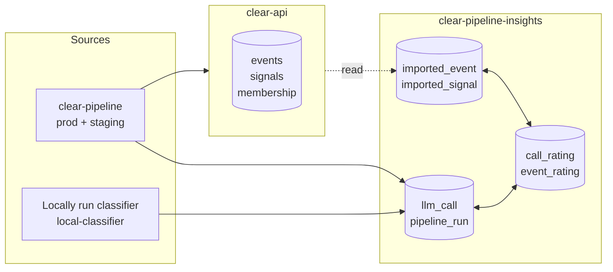
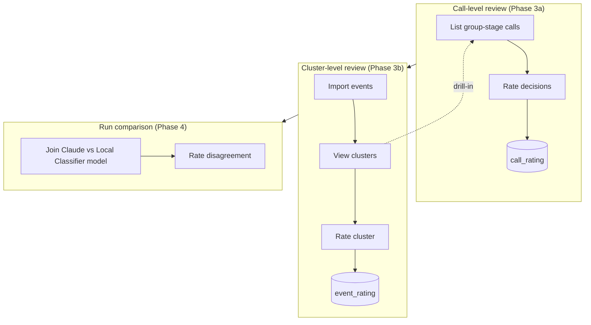
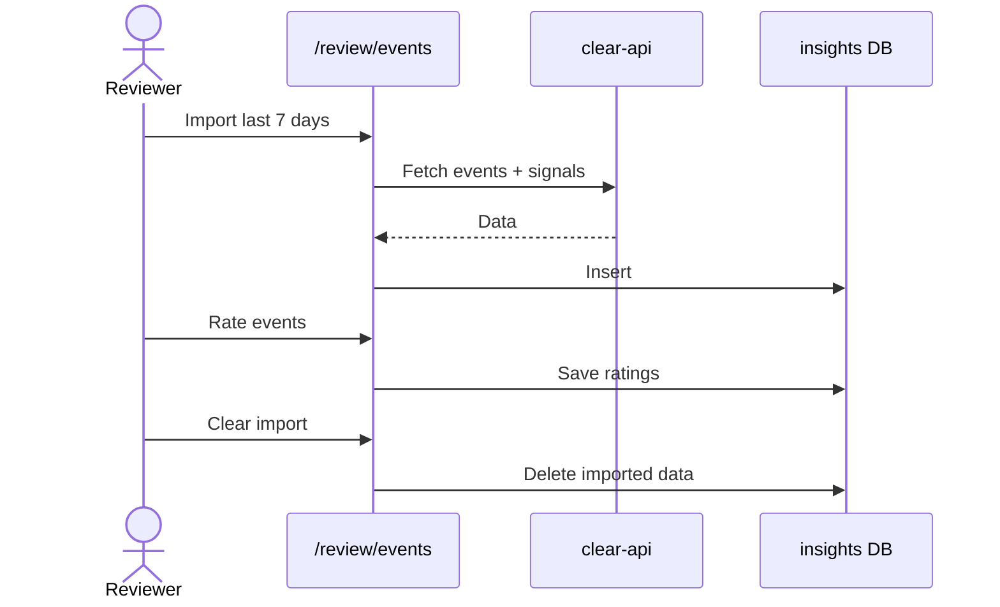

# Data Pipeline Quality Review Strategy `clear-pipeline-insights`

---

## Problem

The data pipeline has multiple distinct steps with each multiple functions needed per step. We currently have no measure of performance or cost per pipeline step or step-function. This way systematic improvement and cost control is unachievable.

This becomes evident as example in:

- No one has defined what "good" looks like
- There's no tooling for humans to rate decisions
- Proprietary classifier has no comparison baseline

**Core idea:**

> Build the review surface first, stage the work so each phase is independently useful, and let "good" emerge from real human ratings — not upfront definitions.

---

## Where Data Lives — and Why Ratings Live Here

### Existing systems

- **`clear-api`**
    - Owns: events, signals, cluster membership
    - Role: domain truth (used by field teams)
- **`clear-pipeline-insights`**
    - Owns: LLM calls (prompt, response, cost, latency)
    - Role: observability + evaluation (used by engineers)
- **`clear-pipeline`**
    - Owns: the execution of pipeline steps and step functions (clustering, scoring, text generation)
    - Role: process noisy input to provide consumable truth

---

### Why ratings live in insights (not clear-api)

1. **Different audience**
    - Insights → engineers evaluating pipeline quality
    - clear-api → field teams acting on alerts
2. **Different building blocks of the pipeline (e.g. classifiers, scorings, decision makers, generative tools, filters, etc.) live in different stages and repos**
    - (`env = local-model`)
    - clear-api would miss everything that is not already built into dev or staging, stranding half the comparison data
3. **Ratings are keyed on `llm_call.id`**
    - This entity doesn't exist in clear-api

---

### Separation of concerns

- **clear-api → cluster shape (truth)**
- **insights → cluster quality (evaluation)**

---

## Long-Term Data Flow

**Key principle:**

- Insights *reads* from clear-api on demand
- No shared DB
- No schema coupling

---

## Two Review Loops (Composable)

---

### Key Insight

- **Call-level** → catches local reasoning errors
- **Cluster-level** → catches systemic "this doesn't hang together" issues

The system becomes powerful when both are visible **together**.

---

## Import / Clear UX (Phase 3b)

### Important detail

- Ratings are keyed on `event_id`
- Clearing imports **does not delete ratings**
- Re-imported events retain prior ratings

---

## Phase Plan

| Phase | Description | Status |
| --- | --- | --- |
| 1 | Cost observability | ✅ shipped |
| 2 | Liveness + latency metrics | ✅ shipped |
| 3a | Call-level review (`/review/group`) | ✅ shipped |
| 3b | Cluster-level review (`/review/events`) | 🚧 proposed |
| 3c | Extend review to classify + assess | ⏳ deferred |
| 4 | Claude vs Local model comparison | 📌 planned |

---

## Open Questions

1. **Do we want both review layers?**
    - Call-level (micro)
    - Cluster-level (macro)
2. **Import source for Phase 3b**
    - GraphQL (clean, slower)
    - Direct DB (fast, tightly coupled)
3. **Verdict vocabulary**
    - `correct`
    - `wrong_group`
    - `should_be_new`
    - `should_have_merged`
    - `unclear`

    → Missing anything?
4. **Single vs multi-rater**
    - Current: `rater = 'james'`
    - Future: show disagreement or last-write-wins?
5. **Local model integration timing**
    - Needed for Phase 4
    - Pending schema alignment

---

## Non-Goals (Deliberate)

- ❌ Defining "quality" upfront
- ❌ Field-team-facing ratings
- ❌ Automated scoring

> Every score is human-first until we have enough data to automate.

---

## What Would Change This Approach

- Field teams want to rate cluster quality → ratings may move to clear-api
- clear-api introduces a generic feedback system → reuse instead of building
- Local classifier moves to production → simplifies comparison logic

---

## TL;DR

- Build **review tooling first**, not definitions
- Separate:
    - **Truth (clear-api)**
    - **Evaluation (insights)**
- Use:
    - Call-level review (micro errors)
    - Cluster-level review (system coherence)
- Let "good" emerge from **real human judgments over time**
