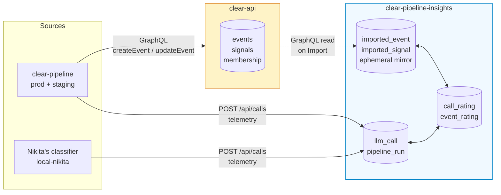
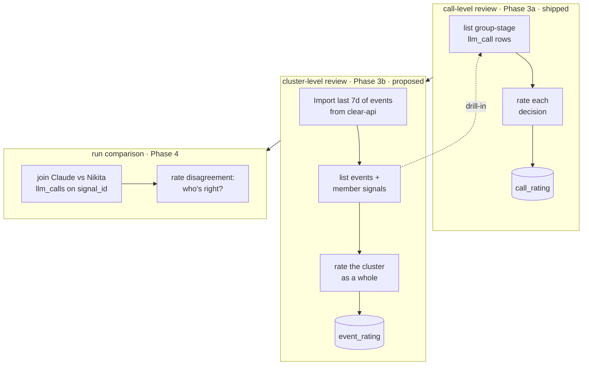
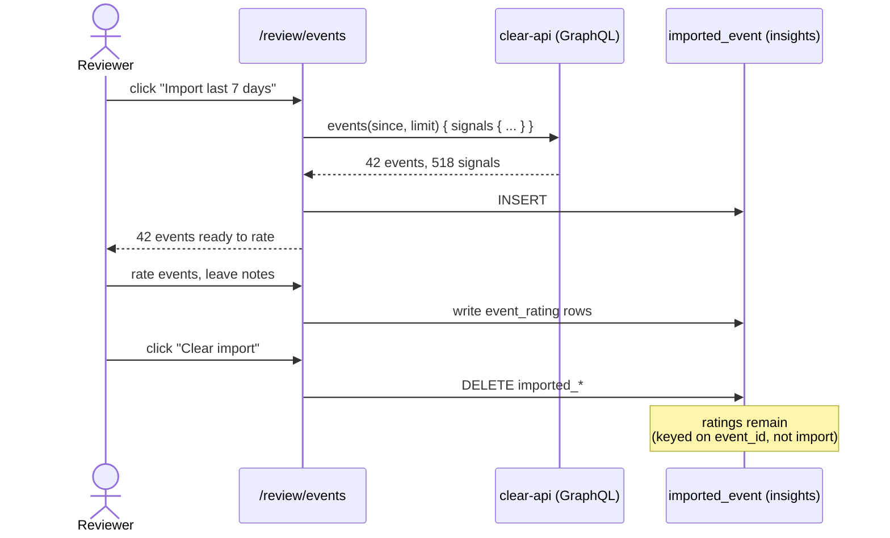

# Quality Review Strategy — clear-pipeline-insights

> **Status**: draft for team feedback · 2026-04-24 · owner: James

## Problem

We're spending real money on Claude calls across **classify**, **group**, and **assess** stages in the pipeline. Nobody on the team has defined what "good" looks like for any of those stages — and the tool for defining it (humans rating concrete decisions) doesn't exist yet. We also have Nikita building a classifier that will eventually replace Claude, but no substrate to compare them on.

This strategy says: **build the review surface in insights, stage the work so each phase is independently valuable, and let "good" emerge from real ratings rather than trying to specify it up front.**

## Where data lives — and why ratings live here

Two existing data stores already carry pipeline state:

- **clear-api** — owns events, signals, cluster membership. The domain truth. Used by the main CLEAR app and field teams.
- **clear-pipeline-insights** (this repo) — owns every LLM call's prompt, response, usage, cost, latency. The observability truth. Used by engineers working on the pipeline.

**Ratings go here, not in clear-api**, because:

1. **Audience**. This tool is for engineers evaluating the pipeline (James, Prajava, Nikita). Not field teams acting on alerts. clear-api's existing `user_interactions` on alerts is a different signal for a different audience — we don't merge them.
2. **Nikita's classifier only exists in insights** (`env='local-nikita'`). Ratings in clear-api would strand half the comparison data.
3. **Call-level ratings are keyed on `llm_call.id`** — that row doesn't exist in clear-api.

clear-api stays the source of truth for **cluster shape**. Insights becomes the source of truth for **cluster quality**.

## Long-term data flow

Dashed line = insights reads clear-api on demand only. No shared database, no background sync, no cross-repo schema coupling at the DB layer.

## Two review loops, composable

The loops compose: on an event detail page you can drill into its constituent `stage='group'` llm_calls, see both the per-call verdicts and the event-level verdict, and surface conflicts (event rated "good" but three of its group calls rated "wrong group"). That surfacing is where the definition of "good" actually gets built.

## Import / Clear UX for Phase 3b

The cluster-level review page does not try to subscribe to clear-api in real time. Instead:

Ratings are keyed on `event_id`, so clearing an import doesn't delete the reviewer's work — if the same event is re-imported later, its existing rating attaches again.

## Phase plan

| Phase | What | Status |
|---|---|---|
| 1 | Cost observability — 24h hero, $/day by env & stage, top runs, models-seen | ✅ shipped |
| 2 | Liveness — `/live`, latency percentiles, parse-error rates, cache savings | ✅ shipped |
| 3a | Call-level grouping review — `/review/group` with verdict widget | ✅ shipped |
| 3b | Cluster-level event review — `/review/events`, Import/Clear from clear-api | **proposed** |
| 3c | Extend call-level review to `classify` and `assess` stages | deferred |
| 4  | Run comparison — side-by-side Claude vs Nikita on same `signal_id` | planned |

## Open questions for the team

1. **Is the call-level vs cluster-level split right?** Call-level catches local errors in Claude's reasoning; cluster-level catches "the whole thing doesn't hang together." Do we want both (proposed), or one?
2. **Phase 3b import source — clear-api GraphQL or direct DB read?** GraphQL respects clear-api as data owner but may need new queries added on its side. Direct DB read is faster to ship but couples us to clear-api's physical schema.
3. **Verdict vocabulary for grouping — `correct / wrong_group / should_be_new / should_have_merged / unclear`**. Right granularity? Missing anything?
4. **Single-rater vs multi-rater?** Rater is currently hardcoded `'james'`. When Prajava and Nikita rate the same decision, do we want agreement/disagreement visible, or last-write-wins?
5. **When does Nikita's classifier start writing to insights?** Phase 4 is gated on this. A 20-min schema review with him is already tracked (bead `clear-pipeline-insights-n1v`).

## Non-goals (deliberate)

- **Defining "quality" before we have ratings.** That's the output of this work, not an input.
- **Field-team-facing ratings.** Those belong in clear-api, alongside the go/no-go feedback that already exists there.
- **Automated quality scoring.** Every score runs through a human until we have enough ratings to know what's worth scoring against.

## What would change my mind

- If field teams want to rate clustering quality too → ratings may need to live in clear-api (or be mirrored there). Today's read: no signal they do.
- If clear-api gets a general-purpose "feedback on X" system → we might use it instead of rolling our own. Today's read: it has `user_interactions` on alerts only, scoped to field teams.
- If Nikita's classifier moves off-laptop into production → `env='local-nikita'` becomes something else and Phase 4 joins get simpler.
